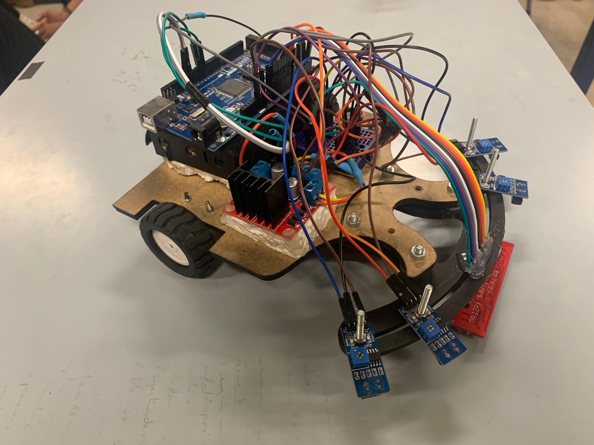
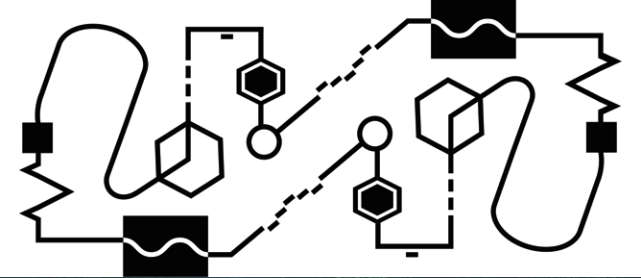
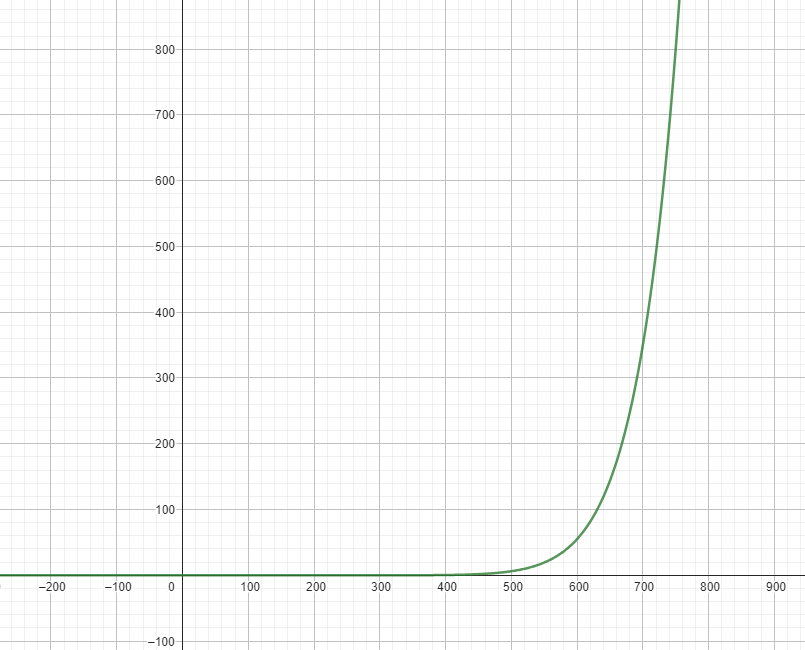

This repository contains info that should hopefully help others building a line follower robot.

Files for the design of 5mayes are available, and the code for it too.





We used 4 IR Sensors (respectively named `farLeft`, `left`, `right` `farRight`), and the `qtr-8a`.

For generally following the line, we used the `qtr-8a`, `left` and `right` the and the PID algorithm (with $K_p = 0.06$ and $K_d = 0$).

At first our PID algorithm only relied on the `qtr_8a`, but we noticed a very good improvement when we added `left` and `right` to the error calculation, giving both very high weights compared to the middle sensors of the qtr. This made it it impossible for 5mayes to exit the line, as it strongly corrected itself if it did so.

With the PID alone we were able to traverse most of the map, but we had to flag various sections of the map, to be aware of where 5mayes was, and what the next obstacle was. 

Flagging each obstacle involved making 5mayes move, setting up a flag that involved checking what combination of `isRight()`, `isLeft()`, `isFarLeft()` and `isFarRight()` was returning true (we even relied on the values from the qtr using `digitalSensors[i]` for some flags), calling `robotStop()` when the flag was activated to debug whether the flag was correct or not, and whether it had a high chance of failure or not.




The main thing about making a line follower robot is having consistent results no matter the conditions, and discovering what factors were at apply for it give to stable results was the difficulty of the challenge.

There were two major changes to 5mayes that were essential for us to achieve decent results, first one was hardware. We had a hard time at first with the IR sensors falling off their place, their height off the ground changing which made their values change, and as such we had to change threshhold and numbers all the time. The frontal part was original just MDF, we ended up 3D printing it making it more robust, and we made sure all the sensors were firmly fixed in place such that their heights don't change and their values would then become generally the same each time we tested.

Second most important change was adding an automatic calibrating function. We did two things here, we agreed on a good range of values that worked well with the threshholds and with the range for the error we calculated for the PID algorithm. Inside of `void setup()` we made a function to register the max and min value for each sensor, and then any value read during `void loop()` would be mapped from that min/max range to the range we want (e.g. IR sensors readings were always mapped between 0 and 700, as such our threshhold of 200 worked perfectly every time we tested).

Another addition was a formula we applied to our qtr. It was giving us really bad numbers, (600 when over white, 780 when over black), which resulted in an error that wouldn't make the PID algorithm function perfectly. Besides mapping to the range (0, 1023) which had a linear effect on the values, we had to apply a smoothing formula, that pretty much made values underneath a certain threshhold negligible, and favored higher values that were closer to 1023. This gave us perfect numbers that we were able to work with

```c
sensorValues[i] = (int)(pow((long double)sensorValues[i]/700, 12)*350);
```



With this, values that were under 700 were generally squashed down so that they wouldn't effect the error.


Despite our robot performing well in the map we had fil INSAT finishing most of it, it performed poorly in the ENSI, barely finishing a quarter of the map. 

Our mistake was we didn't make sure our flags were rock solid and that they worked every single time. The difficulty with line followers is having consistent results. 

Another advice is to make sure you save your latest working code! It can easily be lost, we had this issue the day of the event, and we were using code we weren't sure about, and we even made untested last minute changes that probably contributed to the 5mayes not working!